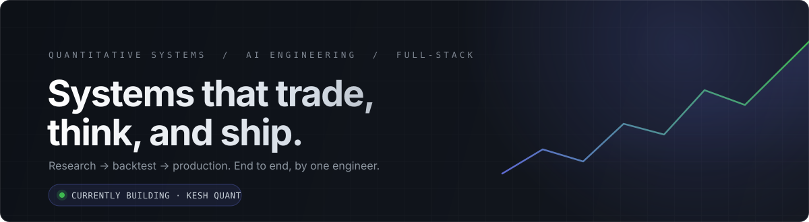
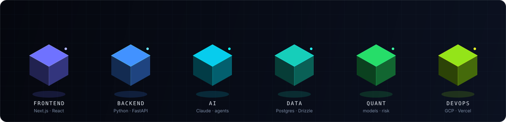
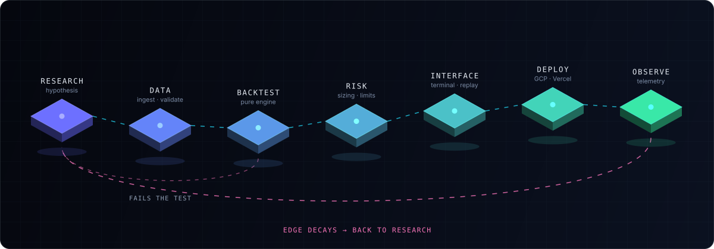

<picture>
  <source media="(prefers-color-scheme: dark)" srcset="assets/hero-dark.svg">
  <source media="(prefers-color-scheme: light)" srcset="assets/hero-light.svg">
  
</picture>

 

### Mohamed Ouaked

**I build the full stack of a trading idea** — the research that finds the edge, the engine that executes it, and the interface that makes it legible.

Quantitative systems · Autonomous agents · Financial analytics · Full-stack product

📍 Tizi Ouzou, Algeria · UTC+1 &nbsp;·&nbsp; Open to remote & relocation

 

[**Case studies**](#04--featured-work) &nbsp;·&nbsp; [**Arsenal**](#03--technical-arsenal) &nbsp;·&nbsp; [**Architecture**](#06--how-i-build) &nbsp;·&nbsp; [**Experience**](#08--experience--credentials) &nbsp;·&nbsp; [**Contact**](#09--get-in-touch)

 

## <samp>01</samp> &nbsp;— &nbsp;Current Mission

> Most trading systems die in one of two places: a backtest nobody can reproduce, or a production deployment nobody can see inside. I build for both ends.

<table>
<tr>
<td valign="top" width="50%">

**🛠 &nbsp;Building**

**Kesh Quant** — an autonomous 24/7 quantitative perpetual-futures engine on Hyperliquid L1, paired with a real-time hedge-fund terminal. Two-tier by design: a high-throughput Python engine on GCP, a Next.js terminal on Vercel, joined by an authenticated REST/WebSocket tunnel.

**ORB Terminal** — a research environment for opening-range-breakout strategies with an ICT/SMC higher-timeframe bias filter, candle-by-candle replay of every execution, and a persistent paper account.

</td>
<td valign="top" width="50%">

**📡 &nbsp;Learning**

**Market microstructure** — order-book dynamics, slippage modelling, and the gap between a fill in a backtest and a fill in production.

**Regime detection** — statistical and ML approaches to knowing *when* a strategy should be switched off.

**Agentic systems** — LLM pipelines that do real operational work: reasoning over market context, drafting outreach, running multi-phase workflows unattended.

</td>
</tr>
</table>

 

## <samp>02</samp> &nbsp;— &nbsp;Engineering Philosophy

<table>
<tr>
<td valign="top" width="50%">

### `01` &nbsp;Backtest before belief

An edge you cannot reproduce is a story, not a strategy. Every system starts as a hypothesis with an out-of-sample test attached, and gets deleted if the test disagrees.

</td>
<td valign="top" width="50%">

### `02` &nbsp;One engine, two modes

Backtest and live run the *exact same* code. The engine is pure functions with no I/O — live feeds it closed bars from a socket, the backtester replays history. Divergence between research and production is a bug, not a fact of life.

</td>
</tr>
<tr>
<td valign="top" width="50%">

### `03` &nbsp;Ship the dashboard with the system

An autonomous process you cannot observe is an autonomous liability. Every engine I deploy ships with the surface that explains what it just did and why.

</td>
<td valign="top" width="50%">

### `04` &nbsp;Automate the work, own the decision

Automation should remove the repetition, not the judgement. The bot sizes the position; the human sets the risk budget. The pipeline drafts the email; the human owns the relationship.

</td>
</tr>
</table>

 

## <samp>03</samp> &nbsp;— &nbsp;Technical Arsenal

Grouped by the problem it solves, not by the logo on the sticker.

 

<picture>
  <source media="(prefers-color-scheme: dark)" srcset="assets/arsenal-dark.svg">
  <source media="(prefers-color-scheme: light)" srcset="assets/arsenal-light.svg">
  
</picture>

 

| Domain | Stack |
| :--- | :--- |
| **Frontend** | TypeScript · React · Next.js 14 (App Router) · Tailwind CSS · shadcn/ui · Recharts · TradingView `lightweight-charts` · `next-themes` |
| **Backend** | Python 3.11 · FastAPI · Node.js · Bun · REST & WebSocket services · JWT / httpOnly session auth · Cron & scheduled workers |
| **AI & Agents** | Anthropic Claude API · LLM-driven signal rationale · Multi-phase agentic pipelines · Prompt & tool design · Deterministic fallbacks for every model call |
| **Data** | PostgreSQL (Neon) · Prisma · Drizzle ORM · SQLite · Pandas / NumPy · CSV ingestion & column auto-mapping · Time-series normalisation |
| **Quant & Finance** | Backtesting engines · Risk & position sizing · Black-Scholes N(d₂) · Futures-implied probability · ORB · ICT / SMC (liquidity sweeps, FVG, MSS, displacement) · RSI, ATR, Bollinger, Donchian, Stochastic, Williams %R · Expectancy, profit factor, R-multiples |
| **Markets & Venues** | Hyperliquid L1 Perps · MetaTrader 5 · Capital.com (REST + WS) · Polymarket · Deribit options chains · CME FedWatch · `yahoo-finance2` |
| **DevOps** | GCP compute (24/7 engines) · Vercel · GitHub Actions · Pytest · Vitest · Telegram Bot API for alerting · Structured logging & health checks |

 

## <samp>04</samp> &nbsp;— &nbsp;Featured Work

Four systems, presented the way I'd present them to a fund. Problem, approach, stack, outcome.

 

### <samp>CASE STUDY 01</samp> &nbsp;· &nbsp;Kesh Quant

**Autonomous quantitative crypto trading engine & terminal**

> Markets run 24/7. Discretionary traders do not.

| | |
| :--- | :--- |
| **Problem** | Perpetual-futures markets never close, but a human's attention does. Any edge that depends on being awake at 03:00 isn't an edge — it's a rota. Running unattended, though, means trusting a process you cannot watch. |
| **Approach** | A decoupled two-tier architecture. A high-throughput Python engine ingests Hyperliquid WebSocket candles and order-book data, computes features (FVG, supply/demand, market-structure shifts, classical TA), passes them through a confluence filter, and sizes positions through a dedicated risk engine — running continuously on GCP. A separate Next.js terminal on Vercel reads engine state over an authenticated REST/WebSocket tunnel, so observation never blocks execution. |
| **Stack** | `Python 3.11` `FastAPI` `Hyperliquid SDK` `WebSockets` `Pytest` `Next.js 14` `TypeScript` `GCP` `Vercel` |
| **Outcome** | A trading system that runs unattended and stays fully observable — the engine's decisions are inspectable in real time rather than reconstructed from logs after the fact. Risk logic lives in one place instead of being scattered across strategy code. |

**[Repository →](https://github.com/nate0004/crypto-bot)** &nbsp;·&nbsp; 🔒 Terminal runs against a private deployment — walkthrough available on request.

 

### <samp>CASE STUDY 02</samp> &nbsp;· &nbsp;ORB Terminal

**Backtesting & paper-trading research environment**

> A win rate without a replay is a rumour.

| | |
| :--- | :--- |
| **Problem** | Opening-range-breakout strategies look excellent in aggregate statistics and awful in specific trades. Summary metrics hide *why* a system loses — and without the why, you can't fix the entry, the filter, or the exit. |
| **Approach** | A research terminal built around inspectability. Every backtested execution can be replayed candle-by-candle on a TradingView chart alongside the higher-timeframe ICT/SMC bias that permitted it. Full analytics sit on top of a persistent paper account, and the strategy engine is covered by a dedicated test suite so a refactor can't silently change historical results. Simulation-only by design — the research surface places no live orders. |
| **Stack** | `Next.js 14` `TypeScript` `Drizzle ORM` `Neon Postgres` `lightweight-charts` `Recharts` `Tailwind` `shadcn/ui` `Vitest` |
| **Outcome** | Strategy iteration moved from arguing about averages to watching individual trades fail — which is where the actual parameter changes come from. Paper state persists across sessions, so forward-testing survives a browser refresh. |

🔒 Private repository — happy to walk through the architecture and engine design on request.

 

### <samp>CASE STUDY 03</samp> &nbsp;· &nbsp;Polymarket vs. Wall Street

**Cross-venue probability divergence dashboard**

> Two markets, one event, two prices. The spread is the signal.

| | |
| :--- | :--- |
| **Problem** | Prediction markets and institutional derivatives venues price the *same* binary macroeconomic events — a Fed cut at a given FOMC, a threshold breach by a date — at materially different probabilities. Those divergences are informative, but they're buried in incompatible data sources and quoted in incompatible units. |
| **Approach** | Aggregate decentralised prediction-market odds and traditional venue data, then normalise both into a common probability space using institutional pricing methodology. Rate events resolve through futures-implied probability from CME FedWatch; crypto events derive theirs from Deribit BTC options chains via Black-Scholes **N(d₂)**, with CME covering the remaining equity-linked events such as SPY. The dashboard surfaces retail-vs-institutional sentiment on identical events, side by side, in real time. |
| **Stack** | `Next.js 14` `TypeScript` `Tailwind CSS` `Polymarket API` `Deribit API` `CME FedWatch` `Black-Scholes N(d₂)` `In-memory LRU cache` |
| **Outcome** | A single view where the gap between decentralised and institutional pricing is directly readable — turning a cross-venue comparison that previously took manual spreadsheet work into a live analytics surface. High-throughput ingestion holds **sub-100 ms** response times via in-memory LRU caching. |

**[Repository →](https://github.com/nate0004/polymarket-vs-wallstreet)** &nbsp;·&nbsp; 🔒 Runs locally against live market data — no hosted instance.

 

### <samp>CASE STUDY 04</samp> &nbsp;· &nbsp;ICT 2022 Signal Bot

**Signal-only intraday engine for the Nasdaq 100**

> The hardest part of automation is deciding what to *not* automate.

| | |
| :--- | :--- |
| **Problem** | The ICT 2022 model is a precise sequence — liquidity sweep, displacement with a fair-value gap, market-structure shift, retrace into the FVG — but detecting it live requires stateful bar-by-bar logic, and any drift between the backtested rules and the live rules invalidates the research entirely. |
| **Approach** | One engine, two modes. The detection logic is pure functions and classes with zero I/O: live mode feeds it closed M1 bars from a Capital.com WebSocket, backtest mode replays historical bars through the identical code path. Signals are scored, composed into entry / stop / target / R:R, annotated with an LLM-generated rationale (with a deterministic fallback when the model is unavailable), delivered to Telegram, and persisted to SQLite with outcomes for later review. Restricted to London and New York killzones — and it never places an order. |
| **Stack** | `Python` `WebSockets` `Capital.com API` `SQLite` `LLM rationale layer` `Telegram Bot API` |
| **Outcome** | Backtest and live results are structurally guaranteed to match, because they execute the same functions. Every delivered signal is stored with its outcome, which turns the alert feed into a growing dataset for evaluating the model rather than a stream of disposable notifications. |

**[Repository →](https://github.com/nate0004/ict-signal-bot)**

 

<b>&nbsp;Also in the workshop</b> &nbsp;— six more systems

 

| Project | What it does | Stack |
| :--- | :--- | :--- |
| **[TradeJournal](https://github.com/nate0004/trading-journal)** | A fast, CSV-first trading journal focused on the metrics that actually reveal an edge — expectancy, profit factor, avg R:R, equity curve, performance split by pair, tag, and session. | `Next.js 14` `Prisma` `PostgreSQL` `Recharts` |
| **[Cold Outreach Pipeline v2](https://github.com/nate0004/outreach-dashboard-v2)** | An autonomous four-phase B2B pipeline: lead generation → AI-generated mockup landing pages → AI cold emails → automated follow-up cron. | `Next.js` `Neon` `Drizzle` `Claude API` `Google Places` |
| **[Stock Checker](https://github.com/nate0004/stock-checker)** | Multi-ticker daily scanner computing RSI, Stochastic, Bollinger, Donchian, Williams %R and ATR-based stop / target / trailing levels, with weighted BUY-HOLD-SELL scoring and chart-pattern detection. | `TypeScript` `Bun` `yahoo-finance2` |
| **[OVN Breakout Bots](https://github.com/nate0004/ovn-breakout-bot)** | The overnight-range breakout strategy productionised across instruments — [NAS100](https://github.com/nate0004/nas100-ovn-bot) and [MNQ](https://github.com/nate0004/mnq-ovn-bot) — executing through MetaTrader 5 with Telegram alerting. | `Python` `MetaTrader5` `Telegram` |
| **[Kesh Investment](https://github.com/nate0004/Kesh-Investment)** | Investment-facing product surface for the Kesh systems. | `TypeScript` `Next.js` |
| **[Gamified Journal](https://github.com/nate0004/gamified-journal)** | Trading discipline treated as a game loop — streaks, scoring and progression applied to process adherence rather than P&L. | `JavaScript` |

 

## <samp>05</samp> &nbsp;— &nbsp;The Journey

Expand any chapter.

 

<b><samp>2024</samp> &nbsp;· &nbsp;Foundations</b> &nbsp;— first commits, market data, Python

 

Started with the smallest honest question: *can I get clean market data and compute something true from it?* Python, pandas, indicator maths from first principles rather than from a library I didn't understand. Most of what I built here was thrown away — deliberately. The output wasn't code, it was the working knowledge of how price data actually behaves once you touch it.

<b><samp>2025</samp> &nbsp;· &nbsp;Research & Strategy</b> &nbsp;— backtesting, ICT/SMC, opening-range breakout

 

The year of learning that *a strategy is a hypothesis*. Built backtesting harnesses before building strategies, studied ICT/SMC market structure alongside classical breakout models, and started measuring everything in expectancy and R-multiples instead of win rate. The core discipline formed here: if a result can't survive out-of-sample, it doesn't get deployed.

<b><samp>2026 · H1</samp> &nbsp;· &nbsp;Full-Stack Terminals</b> &nbsp;— Next.js, Postgres, analytics surfaces

 

Realised the bottleneck wasn't strategy quality — it was visibility. Moved into full-stack product: trading journals with real analytics, research terminals with chart replay, dashboards that turn a stream of events into a readable position. Next.js 14, Postgres, Drizzle and Prisma, TradingView charts. Every engine got a face.

<b><samp>2026 · H2</samp> &nbsp;· &nbsp;Autonomous & Agentic</b> &nbsp;— 24/7 engines, AI pipelines, cloud deployment

 

Systems that run without me. A continuous quantitative engine on GCP trading perps on Hyperliquid, agentic pipelines that execute multi-phase business workflows unattended, LLM layers that explain machine decisions in human language. The current frontier: making autonomy *trustworthy* — observable, bounded, and reversible.

 

## <samp>06</samp> &nbsp;— &nbsp;How I Build

The path every system takes, from a question to something running in production.

 

<picture>
  <source media="(prefers-color-scheme: dark)" srcset="assets/pipeline-dark.svg">
  <source media="(prefers-color-scheme: light)" srcset="assets/pipeline-light.svg">
  
</picture>

**The loop matters more than the line.** A strategy that fails the backtest returns to research immediately — that's cheap. A strategy that decays in production returns to research too, and the observation layer is what tells me *when*. Nothing ships without the last two stages.

<!--
  ── SIGNALS PANEL (lowlighter/metrics) ────────────────────────────────────
  Uncomment this block AFTER running .github/workflows/metrics.yml once, so
  the SVGs exist. Referencing them before that renders broken images.
  Setup instructions are in the workflow file header.

 

  
  

-->

 

## <samp>07</samp> &nbsp;— &nbsp;Focus & Roadmap

◆ &nbsp;shipped &nbsp;&nbsp;·&nbsp;&nbsp; ◇ &nbsp;in flight

<table>
<tr>
<td valign="top" width="50%">

**Now**

◆ &nbsp;Two-tier autonomous engine architecture
 ◆ &nbsp;Unified backtest / live execution path
 ◆ &nbsp;Persistent outcome logging across signal systems
 ◇ &nbsp;Live execution telemetry with automated kill switches
 ◇ &nbsp;Portfolio-level risk allocation across strategies

</td>
<td valign="top" width="50%">

**Next**

◇ &nbsp;ML-driven regime detection to gate strategy activation
 ◇ &nbsp;Execution-cost modelling: slippage, funding, fee drag
 ◇ &nbsp;Multi-venue routing and consolidated position view
 ◇ &nbsp;Public research write-ups on strategy decay
 ◇ &nbsp;Open-sourcing the backtesting core

</td>
</tr>
</table>

 

## <samp>08</samp> &nbsp;— &nbsp;Experience & Credentials

<table>
<tr>
<td valign="top" width="50%">

**Experience**

**Web Developer** — Asalis Consulting
 Jun 2026 – Present
 Designed and built the company website end to end, from visual design through to a responsive TypeScript/React frontend.

 

**Backend Developer** *(Volunteer)* — KESH
 Apr 2025 – Jan 2026
 Core backend services for a creator-athlete marketplace: high-throughput REST APIs and Postgres query optimisation.

</td>
<td valign="top" width="50%">

**Education**

**BSc, Accounting & Finance**
 The reason the quant work isn't cargo-culted — the models get implemented from the theory, not from a library I don't understand.

 

**Certifications** &nbsp;· Anthropic

◆ &nbsp;Claude Code 101
 ◆ &nbsp;Claude Code in Action
 ◆ &nbsp;Introduction to Agent Skills
 ◆ &nbsp;AI Fluency for Small Businesses (2026)

 

**Languages**

English <b>C1</b> &nbsp;·&nbsp; French <b>C2</b> &nbsp;·&nbsp; Arabic <b>Native</b>

</td>
</tr>
</table>

 

## <samp>09</samp> &nbsp;— &nbsp;Get in Touch

Open to remote quantitative engineering and full-stack roles worldwide, and to relocation. EU hours with US East overlap.

  

| | | | |
| :---: | :---: | :---: | :---: |
| **[LinkedIn](https://linkedin.com/in/mohamed-ouaked)** | **[GitHub](https://github.com/nate0004)** | **[X / Twitter](https://x.com/berso444)** | **[Résumé](https://app.notion.com/p/Moha-Resume-f107974e66328298a95f013d754e75c0)** |
| the record | the work | the thinking | the summary |

 

**[✉️ &nbsp;okd.moha@gmail.com](mailto:okd.moha@gmail.com)**

 

 

### *"Alpha decays. Systems compound."*

Built by **Mohamed Ouaked** &nbsp;·&nbsp; <samp>nate0004</samp>

 

