<picture>
  <source media="(prefers-color-scheme: dark)" srcset="assets/mark-dark.svg">
  <source media="(prefers-color-scheme: light)" srcset="assets/mark-light.svg">
  
</picture>

### Systems that trade, think, and ship.

<samp>QUANTITATIVE SYSTEMS &nbsp;/&nbsp; AI ENGINEERING &nbsp;/&nbsp; FULL-STACK</samp>

**Mohamed Ouaked** — I build the full stack of a trading idea: the research, the engine, and the screen that makes it legible.

📍 Tizi Ouzou, Algeria · UTC+1 &nbsp;·&nbsp; Open to remote & relocation

 

[**Stack**](#02--technical-arsenal) &nbsp;·&nbsp; [**Journey**](#03--the-journey) &nbsp;·&nbsp; [**Method**](#04--how-i-build) &nbsp;·&nbsp; [**Roadmap**](#05--roadmap) &nbsp;·&nbsp; [**Track record**](#06--track-record) &nbsp;·&nbsp; [**Contact**](#07--get-in-touch)

 

<picture>
  <source media="(prefers-color-scheme: dark)" srcset="https://contribution.oooo.so/_/nate0004?chart=3dbar&amp;gap=0.6&amp;scale=2&amp;flatten=0&amp;gradient=false&amp;legend=true&amp;legendPosition=bottomLeft&amp;legendDirection=row&amp;strokeWidth=2&amp;strokeColor=222222&amp;weeks=30&amp;theme=cyan&amp;dark=true&amp;format=svg">
  <source media="(prefers-color-scheme: light)" srcset="https://contribution.oooo.so/_/nate0004?chart=3dbar&amp;gap=0.6&amp;scale=2&amp;flatten=0&amp;gradient=false&amp;legend=true&amp;legendPosition=bottomLeft&amp;legendDirection=row&amp;strokeWidth=2&amp;strokeColor=222222&amp;weeks=30&amp;theme=cyan&amp;dark=false&amp;format=svg">
  
</picture>

<samp>COMMIT ACTIVITY &nbsp;·&nbsp; LAST 30 WEEKS</samp>

 

## <samp>01</samp> &nbsp;— &nbsp;Current Mission

<table>
<tr>
<td valign="top" width="50%">

**⚡ &nbsp;Building**

`KESH QUANT` &nbsp;24/7 perps engine on Hyperliquid. Python on GCP, Next.js terminal on Vercel.

`ORB TERMINAL` &nbsp;Backtest and paper-trade environment with candle-by-candle replay.

</td>
<td valign="top" width="50%">

**◎ &nbsp;Learning**

`MICROSTRUCTURE` &nbsp;Order books, slippage, and why a backtest fill lies.

`REGIME DETECTION` &nbsp;Knowing *when* to switch a strategy off.

`AGENTIC SYSTEMS` &nbsp;LLM pipelines doing real operational work.

</td>
</tr>
</table>

 

## <samp>02</samp> &nbsp;— &nbsp;Technical Arsenal

<picture>
  <source media="(prefers-color-scheme: dark)" srcset="assets/arsenal-dark.svg">
  <source media="(prefers-color-scheme: light)" srcset="assets/arsenal-light.svg">
  
</picture>

| | |
| :--- | :--- |
| **Frontend** | TypeScript · Next.js 14 · React · Tailwind · shadcn/ui · Recharts · `lightweight-charts` |
| **Backend** | Python 3.11 · FastAPI · Node · Bun · REST + WebSocket services · JWT sessions · cron workers |
| **AI** | Claude API · LLM signal rationale · multi-phase agent pipelines · deterministic fallbacks |
| **Data** | Neon Postgres · Drizzle · Prisma · SQLite · pandas / NumPy · time-series normalisation |
| **Quant** | Backtest engines · risk & sizing · Black-Scholes N(d₂) · ORB · ICT/SMC · expectancy & R-multiples |
| **Venues** | Hyperliquid · MetaTrader 5 · Capital.com · Polymarket · Deribit · CME FedWatch |
| **DevOps** | GCP · Vercel · GitHub Actions · Pytest · Vitest · Telegram alerting |

 

## <samp>03</samp> &nbsp;— &nbsp;The Journey

<b><samp>2024</samp> &nbsp;Foundations</b> &nbsp;— market data, Python, indicator maths

 

Indicator maths from first principles rather than a library I didn't understand. Most of it was thrown away on purpose — the output wasn't code, it was knowing how price data behaves once you touch it.

<b><samp>2025</samp> &nbsp;Research</b> &nbsp;— backtesting, ICT/SMC, opening-range breakout

 

Built the backtest harness before the strategies. Started measuring in expectancy and R-multiples instead of win rate. The rule that stuck: if it can't survive out-of-sample, it doesn't deploy.

<b><samp>2026 · H1</samp> &nbsp;Terminals</b> &nbsp;— Next.js, Postgres, replay

 

The bottleneck wasn't strategy quality, it was visibility. Journals with real analytics, research terminals with chart replay. Every engine got a face.

<b><samp>2026 · H2</samp> &nbsp;Autonomy</b> &nbsp;— 24/7 engines, agentic pipelines

 

Systems that run without me: a continuous engine on GCP, agent pipelines executing multi-phase workflows unattended. The current problem is making autonomy *trustworthy* — observable, bounded, reversible.

 

## <samp>04</samp> &nbsp;— &nbsp;How I Build

<picture>
  <source media="(prefers-color-scheme: dark)" srcset="assets/pipeline-dark.svg">
  <source media="(prefers-color-scheme: light)" srcset="assets/pipeline-light.svg">
  
</picture>

**The loops matter more than the line.** Failing the backtest is cheap. Decaying in production is not — the observation layer is what tells me when. Nothing ships without the last two stages.

<!--
  ── SIGNALS PANEL (lowlighter/metrics) ────────────────────────────────────
  Uncomment AFTER running .github/workflows/metrics.yml once, so the SVGs
  exist. Referencing them before that renders broken images.

  
  

-->

 

## <samp>05</samp> &nbsp;— &nbsp;Roadmap

<picture>
  <source media="(prefers-color-scheme: dark)" srcset="assets/roadmap-dark.svg">
  <source media="(prefers-color-scheme: light)" srcset="assets/roadmap-light.svg">
  
</picture>

 

## <samp>06</samp> &nbsp;— &nbsp;Track Record

<picture>
  <source media="(prefers-color-scheme: dark)" srcset="assets/credentials-dark.svg">
  <source media="(prefers-color-scheme: light)" srcset="assets/credentials-light.svg">
  
</picture>

 

## <samp>07</samp> &nbsp;— &nbsp;Get in Touch

Open to remote quantitative engineering and full-stack roles, and to relocation. EU hours with US East overlap.

  

| | | | |
| :---: | :---: | :---: | :---: |
| **[LinkedIn](https://linkedin.com/in/mohamed-ouaked)** | **[GitHub](https://github.com/nate0004)** | **[X](https://x.com/berso444)** | **[Résumé](https://app.notion.com/p/Moha-Resume-f107974e66328298a95f013d754e75c0)** |
| the record | the work | the thinking | the summary |

 

**[✉️ &nbsp;okd.moha@gmail.com](mailto:okd.moha@gmail.com)**

 

 

### *"Alpha decays. Systems compound."*

Built by **Mohamed Ouaked** &nbsp;·&nbsp; <samp>nate0004</samp>

 

