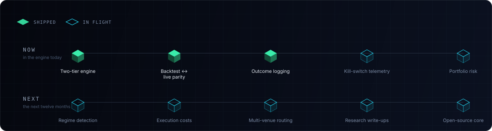
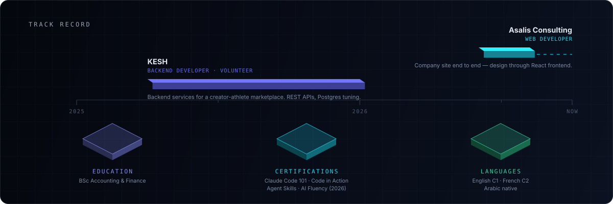

<picture>
  <source media="(prefers-color-scheme: dark)" srcset="assets/hero-dark.svg">
  <source media="(prefers-color-scheme: light)" srcset="assets/hero-light.svg">
  
</picture>

 

### Mohamed Ouaked

**I build the full stack of a trading idea** — the research, the engine, and the screen that makes it legible.

📍 Tizi Ouzou, Algeria · UTC+1 &nbsp;·&nbsp; Open to remote & relocation

 

[**Work**](#03--featured-work) &nbsp;·&nbsp; [**Stack**](#02--technical-arsenal) &nbsp;·&nbsp; [**Method**](#05--how-i-build) &nbsp;·&nbsp; [**Track record**](#07--track-record) &nbsp;·&nbsp; [**Contact**](#08--get-in-touch)

 

## <samp>01</samp> &nbsp;— &nbsp;Current Mission

<table>
<tr>
<td valign="top" width="50%">

**⚡ &nbsp;Building**

`KESH QUANT` &nbsp;24/7 perps engine on Hyperliquid. Python on GCP, Next.js terminal on Vercel.

`ORB TERMINAL` &nbsp;Backtest and paper-trade environment with candle-by-candle replay.

</td>
<td valign="top" width="50%">

**◎ &nbsp;Learning**

`MICROSTRUCTURE` &nbsp;Order books, slippage, and why a backtest fill lies.

`REGIME DETECTION` &nbsp;Knowing *when* to switch a strategy off.

`AGENTIC SYSTEMS` &nbsp;LLM pipelines doing real operational work.

</td>
</tr>
</table>

 

## <samp>02</samp> &nbsp;— &nbsp;Technical Arsenal

<picture>
  <source media="(prefers-color-scheme: dark)" srcset="assets/arsenal-dark.svg">
  <source media="(prefers-color-scheme: light)" srcset="assets/arsenal-light.svg">
  
</picture>

| | |
| :--- | :--- |
| **Frontend** | TypeScript · Next.js 14 · React · Tailwind · shadcn/ui · Recharts · `lightweight-charts` |
| **Backend** | Python 3.11 · FastAPI · Node · Bun · REST + WebSocket services · JWT sessions · cron workers |
| **AI** | Claude API · LLM signal rationale · multi-phase agent pipelines · deterministic fallbacks |
| **Data** | Neon Postgres · Drizzle · Prisma · SQLite · pandas / NumPy · time-series normalisation |
| **Quant** | Backtest engines · risk & sizing · Black-Scholes N(d₂) · ORB · ICT/SMC · expectancy & R-multiples |
| **Venues** | Hyperliquid · MetaTrader 5 · Capital.com · Polymarket · Deribit · CME FedWatch |
| **DevOps** | GCP · Vercel · GitHub Actions · Pytest · Vitest · Telegram alerting |

 

## <samp>03</samp> &nbsp;— &nbsp;Featured Work

 

### <samp>01</samp> &nbsp;Kesh Quant &nbsp;· autonomous perps engine + terminal

> Markets run 24/7. Traders don't.

**Problem** &nbsp;Running unattended means trusting a process you can't watch.
 **Built** &nbsp;Hyperliquid WebSocket → features → confluence filter → risk-sized orders, continuously on GCP. A separate Next.js terminal reads engine state over an authenticated tunnel, so watching never blocks trading.
 **Result** &nbsp;Runs unattended and stays inspectable in real time.

`Python` `FastAPI` `Hyperliquid` `WebSockets` `Next.js` `GCP`

[**Repository →**](https://github.com/nate0004/crypto-bot) &nbsp;🔒 private deployment

 

### <samp>02</samp> &nbsp;ORB Terminal &nbsp;· backtesting + paper-trading research

> A win rate without a replay is a rumour.

**Problem** &nbsp;Summary stats hide *why* a strategy loses — so you can't fix it.
 **Built** &nbsp;Every backtested trade replays candle-by-candle against the higher-timeframe ICT/SMC bias that allowed it. Persistent paper account, engine under test so refactors can't silently rewrite history.
 **Result** &nbsp;Iteration moved from arguing about averages to watching trades fail.

`Next.js 14` `Drizzle` `Neon` `lightweight-charts` `Vitest`

🔒 Private repo — walkthrough on request.

 

### <samp>03</samp> &nbsp;Polymarket vs. Wall Street &nbsp;· probability divergence dashboard

> Two markets, one event, two prices. The spread is the signal.

**Problem** &nbsp;Prediction markets and derivatives venues price identical events differently — in incompatible units.
 **Built** &nbsp;Normalises both into one probability space: CME FedWatch futures-implied for rate events, Deribit BTC options via Black-Scholes N(d₂) for crypto, CME for equity-linked events like SPY.
 **Result** &nbsp;Retail-vs-institutional spread readable live. **Sub-100 ms** ingestion via in-memory LRU caching.

`Next.js 14` `TypeScript` `Deribit` `CME FedWatch` `Black-Scholes`

[**Repository →**](https://github.com/nate0004/polymarket-vs-wallstreet) &nbsp;🔒 no hosted instance

 

### <samp>04</samp> &nbsp;ICT 2022 Signal Bot &nbsp;· signal-only intraday engine, NAS100

> The hard part of automation is choosing what *not* to automate.

**Problem** &nbsp;Any drift between backtested rules and live rules invalidates the research.
 **Built** &nbsp;One engine, two modes — detection logic is pure functions with zero I/O. Live feeds it closed M1 bars from a socket; backtest replays history through the identical path. Signals scored, annotated by an LLM with a deterministic fallback, stored with outcomes.
 **Result** &nbsp;Backtest and live match structurally. Every alert becomes a datapoint. It never places an order.

`Python` `WebSockets` `Capital.com` `SQLite` `Telegram`

[**Repository →**](https://github.com/nate0004/ict-signal-bot)

 

<b>&nbsp;Also in the workshop</b> &nbsp;— six more

 

| Project | What it does |
| :--- | :--- |
| **[TradeJournal](https://github.com/nate0004/trading-journal)** | CSV-first journal built on the metrics that reveal an edge — expectancy, profit factor, R:R, equity curve, splits by pair/tag/session. |
| **[Outreach Pipeline v2](https://github.com/nate0004/outreach-dashboard-v2)** | Four-phase autonomous B2B pipeline: leads → AI mockup pages → AI cold email → follow-up cron. |
| **[Stock Checker](https://github.com/nate0004/stock-checker)** | Multi-ticker scanner: RSI, Stochastic, Bollinger, Donchian, Williams %R, ATR stops, weighted signal scoring. |
| **[OVN Breakout Bots](https://github.com/nate0004/ovn-breakout-bot)** | Overnight-range breakout productionised across [NAS100](https://github.com/nate0004/nas100-ovn-bot) and [MNQ](https://github.com/nate0004/mnq-ovn-bot) via MetaTrader 5. |
| **[Kesh Investment](https://github.com/nate0004/Kesh-Investment)** | Investment-facing surface for the Kesh systems. |
| **[Gamified Journal](https://github.com/nate0004/gamified-journal)** | Trading discipline as a game loop — streaks and scoring on process, not P&L. |

 

## <samp>04</samp> &nbsp;— &nbsp;The Journey

<b><samp>2024</samp> &nbsp;Foundations</b> &nbsp;— market data, Python, indicator maths

 

Indicator maths from first principles rather than a library I didn't understand. Most of it was thrown away on purpose — the output wasn't code, it was knowing how price data behaves once you touch it.

<b><samp>2025</samp> &nbsp;Research</b> &nbsp;— backtesting, ICT/SMC, opening-range breakout

 

Built the backtest harness before the strategies. Started measuring in expectancy and R-multiples instead of win rate. The rule that stuck: if it can't survive out-of-sample, it doesn't deploy.

<b><samp>2026 · H1</samp> &nbsp;Terminals</b> &nbsp;— Next.js, Postgres, replay

 

The bottleneck wasn't strategy quality, it was visibility. Journals with real analytics, research terminals with chart replay. Every engine got a face.

<b><samp>2026 · H2</samp> &nbsp;Autonomy</b> &nbsp;— 24/7 engines, agentic pipelines

 

Systems that run without me: a continuous engine on GCP, agent pipelines executing multi-phase workflows unattended. The current problem is making autonomy *trustworthy* — observable, bounded, reversible.

 

## <samp>05</samp> &nbsp;— &nbsp;How I Build

<picture>
  <source media="(prefers-color-scheme: dark)" srcset="assets/pipeline-dark.svg">
  <source media="(prefers-color-scheme: light)" srcset="assets/pipeline-light.svg">
  
</picture>

**The loops matter more than the line.** Failing the backtest is cheap. Decaying in production is not — the observation layer is what tells me when. Nothing ships without the last two stages.

<!--
  ── SIGNALS PANEL (lowlighter/metrics) ────────────────────────────────────
  Uncomment AFTER running .github/workflows/metrics.yml once, so the SVGs
  exist. Referencing them before that renders broken images.

  
  

-->

 

## <samp>06</samp> &nbsp;— &nbsp;Roadmap

<picture>
  <source media="(prefers-color-scheme: dark)" srcset="assets/roadmap-dark.svg">
  <source media="(prefers-color-scheme: light)" srcset="assets/roadmap-light.svg">
  
</picture>

 

## <samp>07</samp> &nbsp;— &nbsp;Track Record

<picture>
  <source media="(prefers-color-scheme: dark)" srcset="assets/credentials-dark.svg">
  <source media="(prefers-color-scheme: light)" srcset="assets/credentials-light.svg">
  
</picture>

 

## <samp>08</samp> &nbsp;— &nbsp;Get in Touch

Open to remote quantitative engineering and full-stack roles, and to relocation. EU hours with US East overlap.

  

| | | | |
| :---: | :---: | :---: | :---: |
| **[LinkedIn](https://linkedin.com/in/mohamed-ouaked)** | **[GitHub](https://github.com/nate0004)** | **[X](https://x.com/berso444)** | **[Résumé](https://app.notion.com/p/Moha-Resume-f107974e66328298a95f013d754e75c0)** |
| the record | the work | the thinking | the summary |

 

**[✉️ &nbsp;okd.moha@gmail.com](mailto:okd.moha@gmail.com)**

 

 

### *"Alpha decays. Systems compound."*

Built by **Mohamed Ouaked** &nbsp;·&nbsp; <samp>nate0004</samp>

 

